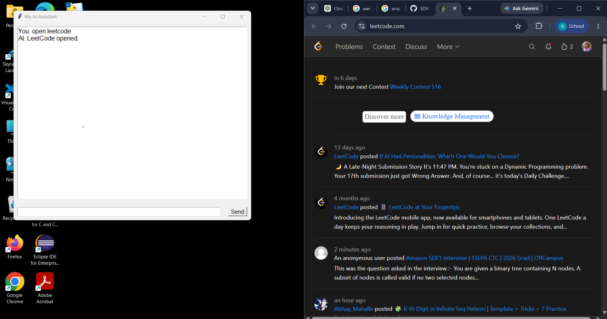
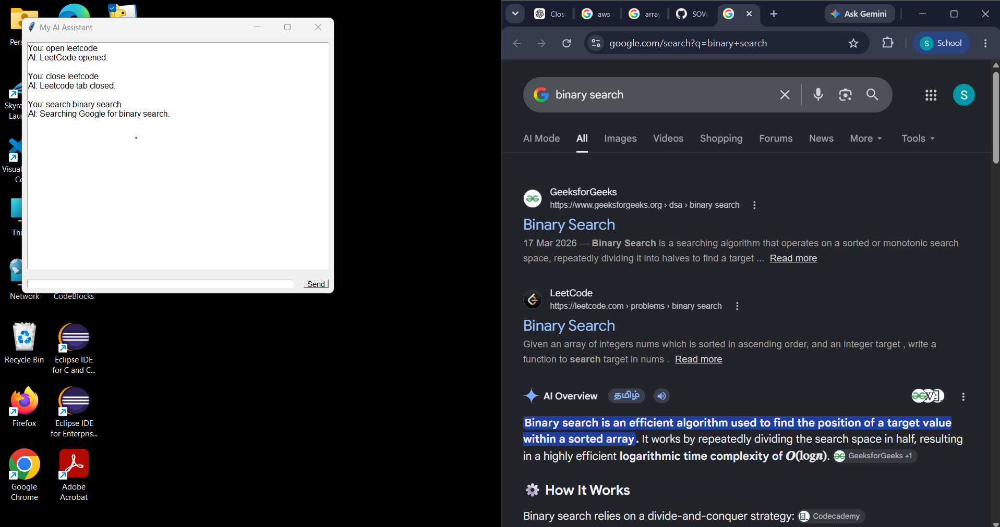
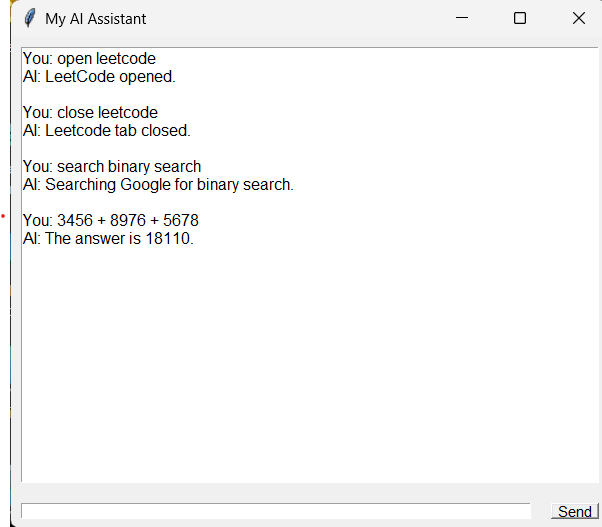

# 🤖 My AI Assistant

### 🚀 From Python Code to a Windows AI Assistant

> 💡 A personal Windows AI Assistant built with **Python** that understands commands and performs application, website, browser, calculation, date/time, and search operations.

---

## 🌟 Day 1 — What I Built

Today I started building my own **Windows AI Assistant** using Python.

The initial goal was to move from a simple **CMD-based program** to a functional **GUI-based Windows application** that can interact with applications and perform useful system tasks.

### 🎯 Today's Achievements

* ✅ Built a command-based AI Assistant
* 🖥️ Created a graphical interface using **Tkinter**
* 🌐 Opened websites using commands
* 🖥️ Opened Windows applications
* ❌ Implemented application closing
* 🌍 Implemented specific browser-tab closing
* 🧮 Added mathematical calculations
* 📅 Added date functionality
* ⏰ Added time functionality
* 🔎 Added Google search
* 🖱️ Used PyAutoGUI for browser automation
* 📦 Converted Python application into `.exe`
* 🪟 Created a Windows desktop application
* 📁 Organized the project for GitHub

---

# ✨ Features

| Feature                 | Description                                               |
| ----------------------- | --------------------------------------------------------- |
| 🌐 Website Control      | Open websites using natural commands                      |
| 🖥️ Application Control | Launch Windows applications                               |
| ❌ Close Applications    | Close applications such as Chrome, Calculator, etc.       |
| 🗂️ Tab Control         | Close specific browser tabs                               |
| 🧮 Calculator           | Perform basic mathematical operations                     |
| 📅 Date                 | Get today's date                                          |
| ⏰ Time                  | Get the current time                                      |
| 🔎 Google Search        | Search anything directly through Google                   |
| 📂 File Access          | Open folders such as Downloads                            |
| 💬 GUI Chatbox          | Interact with the assistant through a graphical interface |
| 📦 Windows `.exe`       | Run the assistant as a normal Windows application         |

---

# 💬 Commands

### 🌐 Open Websites

```text
open leetcode
open linkedin
open github
open youtube
open google
open chatgpt
```

### 🖥️ Open Applications

```text
open chrome
open calculator
open notepad
open vscode
open whatsapp
open cmd
```

### ❌ Close Applications

```text
close chrome
close calculator
close notepad
close vscode
close whatsapp
```

### 🗂️ Close Specific Browser Tabs

```text
close leetcode
close linkedin
close github
close youtube
close chatgpt
```

> 🔥 `close chrome` closes Chrome, while `close leetcode` attempts to close only the LeetCode tab.

### 🧮 Calculator

```text
add 10 + 5
20 - 8
5 * 6
20 / 4
```

Example:

```text
You: add 10 + 5

AI: The answer is 15.
```

### 📅 Date & Time

```text
today date
time
```

### 🔎 Google Search

```text
search AWS cloud computing
```

The assistant automatically opens Google with the requested search query.

---

# 🏗️ Project Architecture

```text
                    👤 USER
                       │
                       ▼
              🖥️ TKINTER GUI
                       │
                       ▼
             ⚙️ COMMAND PROCESSOR
                       │
          ┌────────────┼────────────┐
          │            │            │
          ▼            ▼            ▼
     🖥️ APPLICATIONS  🌐 WEBSITES   🧰 UTILITIES
          │            │            │
          ▼            ▼            ▼
      Chrome        LeetCode       Calculator
      VS Code       LinkedIn       Date
      Notepad       GitHub         Time
      Calculator    YouTube        Search
      WhatsApp      Google
          │            │
          └────────────┼────────────┘
                       ▼
                  🤖 AI RESPONSE
```

---

# 🛠️ Technologies & Tools

### 🐍 Python

Main programming language used to develop the assistant.

### 🖥️ Tkinter

Used to create the graphical chat interface.

### 🖱️ PyAutoGUI

Used for keyboard and mouse automation, especially for browser-tab interaction.

### 📦 PyInstaller

Used to convert the Python application into a Windows executable.

```text
main.py  ──────►  PyInstaller  ──────►  MyAI.exe
```

### 🌐 Webbrowser

Used to open websites from commands.

### ⚙️ Subprocess

Used to launch and close Windows applications.

### 📁 OS Module

Used for file and folder operations.

### 📅 Datetime

Used for date and time commands.

### 🔎 Regular Expressions

Used to detect mathematical expressions.

### 💻 Windows CMD

Used to test and run the Python assistant during development.

### 🌐 Google Chrome

Used as the primary browser for web and tab automation.

---

# 📂 Project Structure

```text
MyAiAssistance/
│
├── 📁 Images/
│   ├── 🖼️ AI1.png
│   ├── 🖼️ ai2.png
│   ├── 🖼️ ai3.png
│   └── 🖼️ ai4.png
│
├── ⚙️ actions.py
├── 🧠 ai.py
├── 🐍 main.py
└── 📦 main.spec
```

### 📄 File Description

| File            | Purpose                                      |
| --------------- | -------------------------------------------- |
| 🐍 `main.py`    | Main Tkinter GUI and command processing      |
| ⚙️ `actions.py` | Application/action-related functionality     |
| 🧠 `ai.py`      | AI-related functionality                     |
| 📦 `main.spec`  | PyInstaller configuration                    |
| 📁 `Images/`    | Project screenshots and visual documentation |

---

# 🖼️ Project Screenshots

## 🤖 AI Assistant Interface


---

## 🖥️ Application & Command Execution



---

## 🌐 Browser Automation



---

## 🪟 Windows Application



---

# 🔄 Development Journey

```text
💻 CMD Program
      │
      ▼
🐍 Python
      │
      ▼
🖥️ Tkinter GUI
      │
      ▼
⚙️ Command Processing
      │
      ▼
🌐 Website + Application Automation
      │
      ▼
🖱️ PyAutoGUI Browser Automation
      │
      ▼
📦 PyInstaller
      │
      ▼
🤖 MyAI.exe
      │
      ▼
🪟 Windows Application
```

---

# 🧠 What I Learned

Today's project helped me understand how Python can interact with the Windows operating system.

I learned how to:

* 🔹 Build a GUI using Tkinter
* 🔹 Process user commands
* 🔹 Launch Windows applications
* 🔹 Open websites programmatically
* 🔹 Control browser tabs
* 🔹 Automate keyboard and mouse actions
* 🔹 Perform calculations
* 🔹 Work with date and time
* 🔹 Open files and folders
* 🔹 Use subprocesses for system operations
* 🔹 Package Python applications into `.exe`
* 🔹 Organize and document a project using GitHub

---

# 🎯 Day 1 Goal

> **Move from a simple CMD program to a functional Windows AI Assistant.**

### ✅ Goal Status

```text
CMD Program          ✅
Python Assistant     ✅
Tkinter GUI          ✅
App Automation       ✅
Website Automation   ✅
Browser Tab Control  ✅
Calculator           ✅
Date & Time          ✅
Google Search        ✅
PyAutoGUI            ✅
Windows .exe         ✅
Desktop Application  ✅
```

---

# 📈 Project Progress

```text
Day 1
  │
  ├── 🐍 Python Foundation       ✅
  ├── 🖥️ Tkinter GUI             ✅
  ├── ⚙️ Command Processing      ✅
  ├── 🌐 Web Automation           ✅
  ├── 🖥️ App Automation           ✅
  ├── 🧮 Calculator               ✅
  ├── 📅 Date & Time              ✅
  ├── 🖱️ PyAutoGUI                ✅
  ├── 📦 PyInstaller              ✅
  └── 🪟 Windows Application      ✅
```

---

# 🌱 Learning in Public

This project is part of my journey to improve my skills in:

**Python → Automation → AI → Windows Development → Full-Stack & Cloud Technologies**

I am documenting my progress and continuously improving this project step by step.

---

# 🏆 Day 1 Completed

> 🚀 **Started with a simple Python program.
> Built a GUI.
> Added automation.
> Converted it into a Windows application.
> And took the first step toward building my own AI Assistant. 🤖**

---

## 🔖 Tags

`#Python` `#AI` `#Windows` `#Tkinter` `#PyAutoGUI` `#PyInstaller` `#Automation` `#GitHub` `#LearningInPublic` `#100DaysOfCode`
